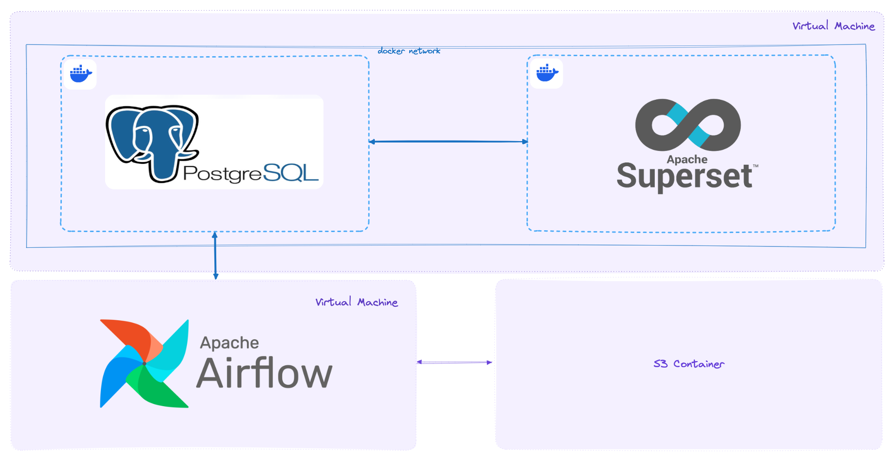

## Платформа для анализа и визуализации данных пользователей банковского сервиса

### Цель
Создать инфраструктуру для обработки и визуализации данных о клиентах банка, включая автоматизацию процессов загрузки новых данных и обновления дашборда аналитиков.

### Технологии
PosgreSQL - в качестве базы данных
Airflow - инструмента для автоматизации процессов загрузки новых данных и обновления дашборда
Superset - для построения дашборда

### Задачи
1. Арендовать виртуальную машину на Selectel, выдерживающую несколько docker-контейнеров. Настроить окружение на витруальной машине. Установить и сконфигурировать PostgreSQL и Superset.
2. Создать базу данных в PostgreSQL.
3. Настроить автоматическую подгрузку данных в БД посредством Airflow. Интервал - 1 час. Загружать новые данные о клиентах из S3-контейнера.
4. Построить дашборд в Superset. Настроить обновление данных, для отражения последних изменений.

